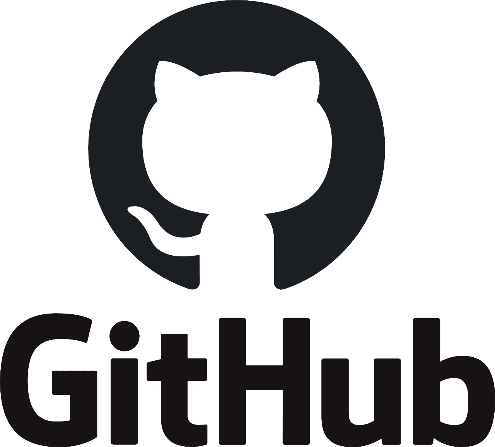
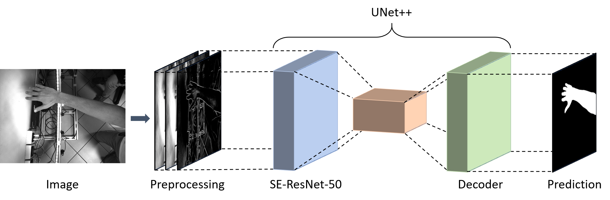

Hi! Thank you for reaching my blog. I am a Software Engineer interested in research-related challenges in the computational field such as Machine Learning, Computer Vision and Robotics.

# Publications

**AutoTune: Metropolis-Hastings Sampling for Automatic Controller Tuning**\\
[Paper](https://github.com/AlessandroSaviolo) [Code](https://github.com/AlessandroSaviolo)\\
*Under review for RA-L IROS 2021. Paper and Code will made publicly available upon acceptance of the paper.*

**Learning to Segment Human Body Parts with Synthetically Trained Deep Convolutional Networks**\\
[Paper](https://github.com/AlessandroSaviolo) [Code](https://github.com/AlessandroSaviolo/HBPSegmentation)\\
*Under review for IAS-16. Paper will be made publicly available soon. Code is already available.*

# Blog Posts

Coming Soon..

# Contact

Alessandro Saviolo\\
Padua, Italy

Follow me on:\\

If you have any question about my research, feel free to contact me at the following email: _alessandro.saviolo_ at _hotmail.com_

  

