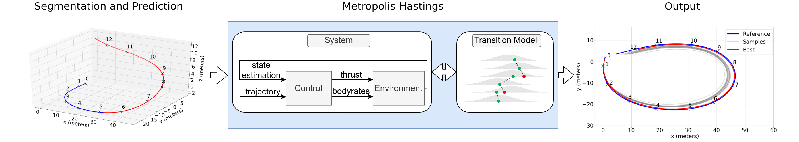

Hi! Thank you for reaching my blog. I am a Software Engineer interested in research-related challenges in the computational field such as machine learning, computer vision and robotics.

# Publications

#### AutoTune: Metropolis-Hastings Sampling for Automatic Controller Tuning

[Paper](https://github.com/AlessandroSaviolo) [Code](https://github.com/AlessandroSaviolo)

Under review for RA-L IROS 2021. Paper and Code will made publicly available upon acceptance of the paper.

# Blog Posts

Coming Soon..

# Contact

Alessandro Saviolo
Padua, Italy

Follow me on: 
[LinkedIn](https://www.linkedin.com/in/alessandro-saviolo/)
[GitHub](https://github.com/AlessandroSaviolo)
[Email](_alessandro.saviolo_@_hotmail.com_)
